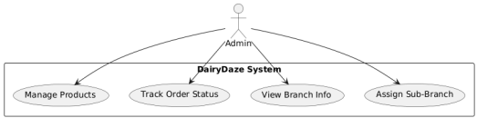
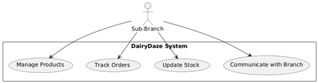
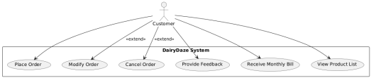
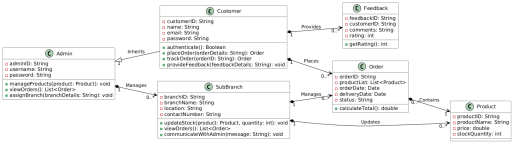
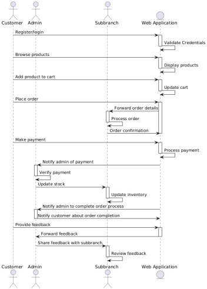

***"DairyDaze"***

**A Project Report Submitted to**

**Rajiv Gandhi Proudyogiki Vishwavidyalaya**

{width="1.8020833333333333in"
height="1.8229166666666667in"}

**Towards Partial Fulfillment for the Award of**

**Bachelor of Technology**

**in**

**Computer Science & Information Technology**

> **Submitted by: Guided by:**
>
> **Rashi Namdev(0827CI221113) Prof.Nisha Rathi Ritika Dongre
> (0827CI221117) Professor, CSIT Department Sansarika Vaishnav
> (0827CI221120) Dr. Vandana Kate Surbhi Kudiwal (0827CI221132)
> Professor, CSIT Department**
>
> {width="1.726388888888889in"
> height="1.101388888888889in"}

**Acropolis Institute of Technology & Research, Indore**

**July- Dec 2024**

1

**DEPARTMENT OF COMPUTER SCIENCE &**

**INFORMATION TECHNOLOGY**

{width="2.046527777777778in"
height="0.9416666666666667in"}

**2024-2026**

**DECLARATION**

> I hereby declare that the work, which is being presented in this
> project entitled "**DairyDaze: Comprehensive Dairy Management
> System**" in partial fulfillment of the requirements for the award of
> degree of **Bachelor of Technology in Computer Science and Information
> Technology**, is authentic record of work carried out by me.

**Place: CSIT, Indore Date:**

**Group Members:**

**Student Name**: Rashi Namdev

**Enrollment Number**: 0827CI221113

**Signature:**

**Student Name**: Ritika Dongre **Enrollment Number**: 0827CI221117
**Signature**:

**Student Name**: Sansarika Vaishnav **Enrollment Number**: 0827CI221120
**Signature**:

**Student Name**: Surbhi Kudiwal **Enrollment Number**: 0827CI221132
**Signature**:

2

**DEPARTMENT OF COMPUTER SCIENCE &**

**INFORMATION TECHNOLOGY**

{width="2.046527777777778in"
height="0.9416666666666667in"}

**2021-2025**

**RECOMMENDATION**

> This is to certify that the work embodied in this project entitled
> **"DairyDaze: Comprehensive Dairy Management System"** submitted by
> **Rashi Namdev(0827CI221113), Ritika Dongre (0827CI221117), Sansarika
> Vaishnav (0827CI221120), Surbhi Kudiwal (0827CI221132)** is a
> satisfactory account of the bonafide work done under the supervision
> of **Prof. Nisha Rathi**, is recommended towards partial fulfillment
> for the award of the Bachelor of Technology in Computer Science &
> Information Technology degree by Rajiv Gandhi Proudyogiki
> Vishwavidyalaya, Bhopal.
>
> **Project Coordinate:**
>
> **Prof. Nisha Rathi**
>
> **CSIT Department**

3

**DEPARTMENT OF COMPUTER SCIENCE &**

**INFORMATION TECHNOLOGY**

{width="2.046527777777778in"
height="0.9416666666666667in"}

**2021-2025**

**CERTIFICATE**

> The Project entitled **"DairyDaze: Comprehensive Dairy Management
> System"** submitted by **Rashi Namdev(0827CI221113), Ritika Dongre
> (0827CI221117), Sansarika Vaishnav (0827CI221120), Surbhi Kudiwal
> (0827CI221132)** has been examined and is hereby approved towards
> partial fulfillment for the award of **Bachelor of Technology** in
> **Computer Science & Information Technology,** for which it has been
> submitted. It is understood that by this approval the undersigned do
> not necessarily endorse or approve any statement made, opinion
> expressed or conclusion drawn therein, but approve the project only
> for the purpose for which it has been submitted.
>
> **Project Coordinator:**
>
> **Prof. Nisha Rathi**
>
> **CSIT Department**
>
> **Date:**

4

**DEPARTMENT OF COMPUTER SCIENCE &**

**INFORMATION TECHNOLOGY**

{width="2.046527777777778in"
height="0.9416666666666667in"}

**2021-2025**

**STUDENT UNDERTAKING**

> This is to certify that project entitled **"DairyDaze: Comprehensive
> Dairy Management System"** has developed by us under the supervision
> of **Prof. Nisha Rathi**. The whole responsibility of work done in
> this project is ours. The sole intension of this work is only for
> practical learning and research.
>
> We further declare that to the best of our knowledge, this report does
> not contain any part of any work which has been submitted for the
> award of any degree either in this University or in any other
> University / Deemed University without proper citation and if the same
> work found then we are liable for explanation to this.
>
> **Group Members:**
>
> ● Rashi Namdev(0827CI221113)
>
> ● Ritika Dongre (0827CI221117)
>
> ● Sansarika Vaishnav (0827CI221120)
>
> ● Surbhi Kudiwal (0827CI221132)
>
> **Date:**

5

**DEPARTMENT OF COMPUTER SCIENCE &**

> **INFORMATION TECHNOLOGY**

{width="2.046527777777778in"
height="0.93748687664042in"}

**2022-2026**

**ACKNOWLEDGEMENT**

> We thank the almighty Lord for giving us the strength and courage to
> sail out through the tough and reach on shore safely.
>
> We owe a debt of sincere gratitude, deep sense of reverence and
> respect to our mentors **Prof. Nisha Rathi,** CSIT Department AITR,
> Indore for their motivation, sagacious guidance, constant
> encouragement, vigilant supervision and valuable critical appreciation
> throughout this project work, which helped us to successfully complete
> the project on time.
>
> We express profound gratitude and heartfelt thanks to **Dr. Shilpa
> Bhalerao, HOD CSIT**, AITR Indore for her support, suggestion and
> inspiration for carrying out this project. We would be failing in our
> duty if do not acknowledge the support and guidance received from
> **Dr. S. C. Sharma,** Director, AITR, Indore whenever needed. We take
> opportunity to convey my regards to the **Acropolis Institute of
> Technology and Research, Indore** for extending academic and
> administrative support and providing us all necessary facilities for
> project to achieve our objectives.

We are grateful to our parent and family members who have always loved
and supported us unconditionally.

> **Group Members:**
>
> ● Rashi Namdev(0827CI221113)
>
> ● Ritika Dongre (0827CI221117)
>
> ● Sansarika Vaishnav (0827CI221120)
>
> ● Surbhi Kudiwal (0827CI221132)
>
> **Date:**

6

**TABLE OF CONTENTS**

> DECLARATION 2 RECOMMENDATION 3 CERTIFICATE 4 STUDENT UNDERTAKING 5
> ACKNOWLEDGEMENT 6 ABSTRACT 7 CONTENTS 8 List of Figures 10 List of
> Tables 11
>
> List of Abbreviations 12 Chapter 1: Introduction 14 1.1 Overview 14
> 1.2 Existing System 14 1.3 Problem Statement 14 1.4 Proposed System 14
> 1.5 Need and Scope 15 1.6 Report Organization 15 Chapter 2: Literature
> Survey 17 2.1 Study 17 2.2 Problem Methodology 17 2.3 Software
> Engineering Paradigm 17 2.4 Software Development Life Cycle: 18 2.5
> Technology Methodology 18 2.6 Hardware Requirements 19 Chapter 3:
> Analysis 21 3.1 Identification of System Requirements 21 3.2
> Functional Requirements 21 3.3 Non-Functional Requirement 22 3.4
> Feasibility Study 22 3.4.1 Technical Feasibility 23 3.4.2 Financial
> Feasibility 24 3.4.3 Operational Feasibility 24

7

> Chapter 4: Project Planning 26 Chapter 5: Design 29 5.1 Introduction
> to UML 29 5.2 UML Diagrams 29 5.2.1 Use Case Diagram 30 5.2.2 Class
> Diagram 31 5.2.3 Sequence Diagram 32 5.2.4.ER Diagram 33 5.2.5
> Activity Diagram 34 References 48 Web Sites 48

8

**LIST OF FIGURES**

> **Figure No. and Title Page No.** Figure 5.2.1 Use case diagram 30
> Figure 5.2.2 Class diagram 31 Figure 5.2.3 Sequence Diagram 32 Figure
> 5.2.4 ER Diagram 33 Figure 5.2.5 Activity Diagram 34 Figure 5.2.6
> Table Structure 35 Figure 6.1 Coding (main module) 39 Figure 6.2
> Results 42

9

**LIST OF TABLES**

> **Table No. and Title Page No.** Table 1: Proposed Timetable 26 Table
> 2: Table Structure 35 Table 3: Database 45

10

**LIST OF ABBREVIATIONS**

> **Abbreviations**
>
> ***Abbr1:***ER- Entity Relation
>
> ***Abbr2:*** UML- Unified modelling language
>
> ***Abbr3:*** API-Application Programming Interface
>
> ***Abbr4:*** JSON- Java Script Object Notation

11

> **ABSTRACT**
>
> The **DairyDaze** platform is an innovative web-based system designed
> to modernize and streamline traditional dairy operations. By
> leveraging the power of data-driven insights and automation, it
> bridges the gap between distributors and customers, addressing
> inefficiencies in inventory management, order fulfillment, and
> customer engagement.
>
> **DairyDaze** provides a comprehensive suite of features, including
> real-time stock visibility, which allows both customers and
> distributors to monitor inventory levels dynamically. This ensures
> transparency in the availability of dairy products, enabling users to
> make informed decisions and avoid stock shortages or surpluses.
>
> The platform\'s automated order tracking system is tailored to cater
> to the dynamic nature of customer needs. Customers can easily modify
> their daily orders, place additional requests, or cancel deliveries,
> while distributors receive instant updates, ensuring seamless
> synchronization. Additionally, **DairyDaze** introduces subscription
> services, enabling customers to set up recurring orders with
> flexibility to modify them as needed.
>
> For a secure and user-friendly experience, **DairyDaze** integrates
> secure payment processing, allowing customers to settle their
> transactions conveniently.

12

CHAPTER-1

13

**Chapter 1: Introduction**

> **1.1 Overview**
>
> **DairyDaze** is an innovative web-based platform designed to
> revolutionize the local dairy supply chain by integrating modern
> technology into traditional dairy operations. It facilitates seamless
> communication and collaboration between dairy business owners,
> distributors, and customers. The platform addresses inefficiencies in
> inventory management, order tracking, and payment processing by
> introducing features such as real-time stock visibility, automated
> order handling, flexible subscription models, and secure payment
> systems. By streamlining these processes, **DairyDaze** aims to reduce
> operational errors, enhance customer satisfaction, and boost the
> overall efficiency of dairy supply chain operations.
>
> **1.2 Existing System**
>
> Existing platforms addressing the dairy supply chain focus primarily
> on specific aspects, such as subscription management or delivery
> coordination, but lack a holistic approach to solving the broader
> challenges faced by both customers and distributors. For instance,
> platforms like **Farmigo** and **MilkMan** provide subscription-based
> services for dairy product delivery, enabling customers to set
> recurring orders. However, these systems often fail to address
> real-time stock visibility or allow for dynamic order adjustments,
> such as placing extra orders or cancellations on short notice.
>
> **1.3 Problem Statement**
>
> The local dairy industry faces a myriad of challenges due to outdated
> practices and lack of technological integration. Customers often
> experience inconsistent delivery due to sudden changes in demand or
> stock shortages. They also lack the ability to modify or cancel their
> orders conveniently, which leads to dissatisfaction and wastage. For
> distributors, the inability to forecast fluctuating demand effectively
> results in either overstock or deficit, creating inefficiencies in
> resource utilization. The lack of a centralized, streamlined system to
> coordinate operations between customers and distributors exacerbates
> these issues, highlighting the urgent need for a digital solution.
>
> **1.4 Proposed System**
>
> The proposed solution is a streamlined web-based platform designed to
> tackle the challenges of the milk supply chain for both customers and
> distributors.
>
> **For Customers:**
>
> The platform provides flexibility to modify, cancel, or place extra
> orders, ensuring their needs are met without wastage. Real-time stock
> visibility and delivery tracking enhance transparency and
> satisfaction. Notifications keep customers informed about updates,
> ensuring a smooth and reliable experience. **For Distributors:**
>
> Distributors benefit from automated demand forecasting, real-time
> inventory management, and synchronized order processing, reducing
> manual errors and optimizing stock levels. Notifications for order
> changes enable quick adjustments, while secure payment integration
> simplifies transaction.

14

> **1.5 Need and Scope**
>
> The DairyDaze platform is essential to modernize traditional dairy
> operations, addressing inefficiencies in order tracking, inventory
> management, and delivery processes. By automating repetitive tasks and
> reducing human errors, the platform provides customers with a
> flexible, user-friendly system to adjust orders, view stock
> availability, and gain real-time transparency. For distributors, it
> offers advanced tools for accurate demand forecasting, effective
> inventory control, and synchronized delivery management. Designed to
> transform small and medium-sized dairy businesses, DairyDaze
> streamlines operations while enhancing reliability and efficiency.
> Over time, its scope extends to integrating advanced technologies like
> IoT for real-time stock monitoring and machine learning for predictive
> analytics. Additionally, its scalable architecture enables adaptation
> for other perishable goods industries, ensuring continued relevance
> and utility in broader supply chain applications.
>
> **1.6 Report Organization**
>
> ➢ Chapter 1 states the overview of the project with the discussing
> about the existing systems in today's scenario. Describing about the
> problem statement we are facing about the system. We have given our
> proposed solution considering all the shortcoming of the previously
> used system.
>
> ➢ Chapter 2 states the literature survey i.e. the background details
> of our system including the software engineering paradigm and
> explaining about the technologies (Software and Hardware requirement)
> which we have used building the system.
>
> ➢ Chapter 3 states about the Analysis of the whole system i.e.
> identification of system requirement about the feasibility
> study-Technical Feasibility, Financial Feasibility, operational
> Feasibility.
>
> ➢ Chapter 4 states Project Planning including scope definition ,work
> down structure, timeline and scheduling, quality management etc.
>
> ➢ Chapter5 about the Design of the whole system including all the UML
> diagrams all the tools used with ER Diagram and Data Flow Diagram and
> Data Dictionary
>
> ➢ Chapter6 states the Implementation phase that define the working on
> the project of our system.
>
> ➢ Chapter7 states the Testing phase of our system all the different
> testing methods and strategies and we have run test cases.
>
> ➢ Chapter8 states the conclusion of the whole system explaining the
> advancement of our project in future.
>
> ➢ References: The books, websites, journals, blogs which we have
> referred.

15

CHAPTER- 2

16

**Chapter 2: Literature Survey**

> **2.1 Study**
>
> 1\. As we all know that in many areas customized application
> software's are required to solve organizational day to day activities.
>
> 2\. Such customization is framed with help of completed domain
> analysis of the functionalities performed at organization at regular
> basis which can be solve with help of application software by reducing
> manual efforts.
>
> 3\. Among the difficulties faced by people of organization by lots of
> paper work and searching for data, arranging them and solving
> complaints, some centralized solutions needed in such busy
> environment.
>
> 4\. This kind of application software's is ready to welcome to
> automate the process to reduce manpower and time consumed for that
> manual process.
>
> 5\. The main aim is to satisfy the user of application and also reduce
> time spent on the manual process which is to complete the cycle of
> registering complaints, processing it and reaching to solutions.
>
> 6\. Our ultimate motto is to mitigate the time consumption in
> processing of complaints and eliminate the paper work of searching/
> sorting for information from distributed places, thereby accomplishing
> both organization user and complainant citizen demands.
>
> **2.2Problem Methodology**
>
> The project follows an agile development methodology, with sprints
> planned to implement and test different features of DairyDaze.
>
> ➢ Requirement Analysis: Gather and analyze requirements from local
> dairy stakeholders to prioritize platform features.
>
> ➢ Design Phase: Create detailed system and database designs, focusing
> on scalability and user friendliness.
>
> ➢ Development Phase: Implement core features using technologies like
> HTML5, CSS3, JavaScript for the front end, and Python/Django for the
> back end.
>
> ➢ Testing and Validation: Conduct rigorous testing, including unit
> tests, integration tests, and user acceptance testing, to ensure a
> robust and secure system.
>
> **2.3 Software Engineering Paradigm**
>
> **[1. Agile Development]{.underline}**
>
> The Agile development paradigm is applied to ensure flexibility and
> adaptability throughout the project lifecycle.
>
> **[2.]{.underline} Reliability:**
>
> The reliability of the software design must be determined. The
> reliability of the software refers to the ability to avoid fault
> occurred in the process of system running.

17

> **[3.]{.underline} Incremental Development:**
>
> The platform is developed in phases, delivering essential features
> like stock management and order tracking first. Subsequent iterations
> add advanced capabilities, ensuring functional improvements at each
> stage.
>
> [4.]{.underline} **Collaboration**:
>
> Developers, designers, and stakeholders work closely to ensure the
> platform aligns with business goals and user expectations. This
> collaborative process enhances transparency and efficiency throughout
> development.
>
> [5.]{.underline} **Continuous Testing and Improvement**:
>
> Agile incorporates ongoing integration and testing to maintain
> platform stability and security. This iterative approach reduces risks
> and ensures a high-quality final product.
>
> [6.]{.underline} **Focus on User-Centric Design**:
>
> Regular user testing ensures the platform is intuitive and easy to
> use. Agile prioritizes designing features that address the practical
> needs of both customers and distributors.
>
> **2.4 [Software Development Life Cycle: ]{.underline}**
>
> ➢ **Requirement Analysis**:
>
> ● Identify the needs of dairy business owners, distributors, and
> customers through surveys and stakeholder discussions.
>
> ● Document the functional requirements such as real-time inventory
> management, order tracking, subscription models, and secure payments.
>
> ➢ **Feasibility Study**:
>
> ● Evaluate technical, operational, and financial feasibility to ensure
> the project aligns with available resources and timelines.
>
> ● Ensure the system is scalable and capable of incorporating future
> enhancements like IoT and predictive analytics.
>
> ➢ **System Design**:
>
> ● Develop detailed architectural diagrams and database schemas to
> structure the platform. ● Design the user interface to ensure a
> seamless and intuitive experience for all users. ➢ **Implementation**:
>
> ● Use technologies like React.js for the front-end, Django for the
> back-end, and PostgreSQL for database management.
>
> ● Develop the system in modules such as customer orders, distributor
> inventory, and payment processing to allow phased implementation.
>
> ➢ **Testing**:
>
> ● Conduct unit, integration, and system tests to verify the
> functionality, performance, and security of the platform.
>
> ● Perform user acceptance testing (UAT) to ensure the system meets
> stakeholder expectations. ➢ **Deployment**:
>
> ● Deploy the platform on a cloud-based server for reliability and
> scalability.
>
> ● Provide training sessions for end-users to familiarize them with the
> system.
>
> ➢ **Maintenance**:
>
> ● Monitor system performance post-deployment and resolve any bugs or
> issues reported by users. ● Roll out regular updates to enhance
> features and accommodate new requirements.
>
> **2.5 Technology Methodology**

18

> **2.5.1 Hardware Requirements:**
>
> The used hardware for development of application system:
>
> 1\. RAM: 16 GB
>
> 2\. Processor: i5 8^th^ generation
>
> **2.5.2 Software Requirements**
>
> The required software for development environment:
>
> ● Operating System: Windows XP onwards (Using Windows11 Pro).
>
> ● Database: PostgreSQL for database support (Using version8.0.34).
>
> ● Backend: Node.js, Django for server-side development (Using
> version18.16.0). ● FrontendDevelopment:
>
> ▪ HTML (for structure), CSS (for styling), and JavaScript (for dynamic
> functionality). ▪ Visual Studio Code (Usingversion1.83.0) as the
> integrated development environment.

19

CHAPTER-3

20

**Chapter 3: Analysis**

> **3.1 Identification of System Requirements**
>
> The **identification of system requirements** is a critical step in
> understanding the functional and non functional needs of the DairyDaze
> platform. This process ensures that the system is designed to
> effectively meet the needs of its users, including the main branch
> owner, sub-branches, and customers. The identified requirements are
> categorized as follows:
>
> 1\. **Functional Requirements:**
>
> ⮚ **Main Branch Owner Capabilities:**
>
> ▪ Ability to manage sub-branch accounts and monitor their activities,
> including the creation and deactivation of accounts.
>
> ▪ Utilize predictive analytics to optimize stock levels, reduce
> wastage, and meet demand efficiently.
>
> ▪ Overview of all customer orders and supply chain data to ensure
> smooth operations. ▪ Generate and review detailed reports related to
> inventory, sales, and revenue to assist in strategic decision-making.
>
> ▪ Access a comprehensive dashboard with real-time metrics and
> analytics for improved operational insights.
>
> ⮚ **Sub-Branch Operations:**
>
> ▪ Manage customer orders effectively, including updating order status
> and ensuring timely deliveries.

▪ Maintain accurate transaction records and update inventory details
regularly.

> ▪ Notify the main branch about inventory shortages or potential
> delivery delays to avoid disruptions.

▪ Track performance metrics and sales data via dedicated dashboards

> ▪ Record transactions and update inventory details.
>
> ⮚ **Customer Features:**

▪ Seamlessly browse available dairy products, check pricing, and place
orders.

▪ Authenticate via Firebase for secure and personalized access to their
accounts.

> ▪ Receive timely notifications regarding order updates, delivery
> status, and promotional offers.

▪ Provide feedback and ratings on products and services to enhance
quality.

> ▪ Set up recurring orders for frequently purchased items through a
> subscription feature for convenience.
>
> 2\. **Non-Functional Requirements:**
>
> ⮚ **Scalability:** The system should support the addition of multiple
> sub-branches and a growing customer base.
>
> ⮚ **Reliability:** Ensure the platform operates without disruptions,
> particularly during peak operational hours.
>
> ⮚ **Performance:** Deliver a fast and responsive user experience, even
> under high traffic. ⮚ **Security:**
>
> ▪ Implement secure user authentication through Firebase.

21

▪ Protect sensitive user data, such as login credentials and transaction
details.

> ⮚ **Usability:** The interface should be user-friendly and intuitive,
> catering to diverse user groups with varying technical expertise.
>
> 3\. **Technical Requirements:**
>
> ⮚ **Frontend Technologies:** HTML and CSS for a responsive and
> engaging user interface. ⮚ **Backend Framework:** Django to manage
> server-side operations and data processing. ⮚ **Database:** A robust
> database system to handle and store data related to orders, users, and
> transactions.
>
> ⮚ **Authentication:** Firebase for secure user verification and
> role-based access control. ⮚ **Email Services:** Integrate email
> verification functionality for customers and sub-branches as per the
> faculty\'s feedback.
>
> 4\. **User Requirements:**
>
> ⮚ Ensure easy onboarding and guidance for sub-branches and customers.
>
> ⮚ Provide the main branch owner with centralized control and
> analytics.
>
> This comprehensive identification of requirements forms the foundation
> for the DairyDaze platform, ensuring it fulfills its objectives of
> streamlining operations, improving efficiency, and enhancing the user
> experience for all stakeholders.
>
> **3.2 Functional Requirements**
>
> The functional requirements for the DairyDaze platform define the
> specific functionalities necessary to address the needs of the main
> branch owner, sub-branches, and customers. These include: 1. **Main
> Branch Owner Functionalities:**
>
> ⮚ **Sub-Branch Management:** Create, update, and deactivate sub-branch
> accounts. ⮚ **Order Tracking:** Monitor all orders placed by
> customers, including status updates provided by sub-branches.
>
> ⮚ **Inventory Oversight:** View real-time inventory levels across
> sub-branches and track replenishment needs.
>
> ⮚ **Report Generation:** Generate detailed reports on sales, orders,
> and revenue to assess overall performance.
>
> ⮚ **Supply Chain Control:** Monitor and optimize the dairy product
> supply chain to ensure timely delivery and minimize wastage.
>
> 2\. **Sub-Branch Functionalities:**
>
> ⮚ **Order Management:** Receive, process, and update the status of
> customer orders. ⮚ **Inventory Management:** Update stock availability
> and notify the main branch owner about inventory shortages.
>
> ⮚ **Transaction Logging:** Record sales and payment details for
> reconciliation and reporting. ⮚ **Customer Interaction:** Handle
> customer queries and update them regarding order status or changes.
>
> 3\. **Customer Functionalities:**
>
> ⮚ **Product Browsing:** View the list of available dairy products and
> their pricing.

22

> ⮚ **Order Placement:** Place orders through an easy-to-use interface,
> specifying quantities and delivery preferences.
>
> ⮚ **Authentication:** Log in securely via Firebase authentication to
> access personalized account features.
>
> ⮚ **Order Tracking:** Receive updates on the status of their orders,
> including notifications for dispatched and delivered items.
>
> ⮚ **Feedback Mechanism:** Provide feedback or ratings on products and
> services to improve the system.
>
> 4\. **Admin Functionalities (if applicable):**
>
> ⮚ Oversee system operations and perform high-level troubleshooting.
>
> ⮚ Ensure data integrity by managing role-based access and privileges
> across all user groups. **3.3 Non-Functional Requirement**
>
> 1\. **Performance:** Ensure quick response times (2-3 seconds) and
> handle multiple users simultaneously without lag.
>
> 2\. **Scalability:** Support business growth with additional users,
> sub-branches, and data. 3. **Reliability:** Maintain 99.9% uptime and
> include robust error-handling mechanisms. 4. **Security:** Implement
> Firebase authentication, encrypt sensitive data, and protect against
> common vulnerabilities.
>
> 5\. **Usability:** Design an intuitive, user-friendly interface with
> clear navigation and tooltips for guidance.
>
> 6\. **Maintainability:** Use clean, modular code for easy updates and
> minimal downtime during maintenance.
>
> 7\. **Compatibility:** Ensure accessibility across popular browsers
> and devices; integrate with external email APIs.
>
> 8\. **Efficiency:** Optimize backend processes and use caching to
> minimize resource usage and load times. 9. **Auditability:** Maintain
> detailed logs of user actions for troubleshooting and compliance.
>
> **3.4 Feasibility Study**
>
> The feasibility study evaluates the DairyDaze platform\'s practicality
> by examining its **technical, financial, operational, schedule, and
> legal viability**. This comprehensive assessment ensures the project
> is achievable and sustainable under real-world conditions.
>
> **3.4.1 Technical Feasibility**
>
> The technical feasibility of the DairyDaze platform lies in its use of
> proven, reliable, and scalable tools.
>
> 1\. **Frontend Development**:
>
> ▪ The platform employs **HTML** and **CSS**, which are widely used for
> creating responsive and user-friendly interfaces.
>
> ▪ The frontend ensures compatibility across devices and browsers,
> enhancing user accessibility and engagement.
>
> 2\. **Backend Framework**:

23

> ▪ **Django**, a robust Python-based web framework, is used for
> managing the server-side logic and business operations.
>
> ▪ It offers a modular structure, facilitating seamless integration of
> various features like inventory management, order tracking, and
> role-based access control.
>
> 3\. **Authentication and Security**:
>
> ▪ **Firebase Authentication** provides secure login functionality,
> ensuring that roles such as main branch owners, sub-branches, and
> customers have appropriate access privileges. ▪ It minimizes security
> risks by enforcing data protection and strong authentication
> protocols. 4. **Database Management**:
>
> ▪ The platform's database efficiently handles complex data
> requirements such as order records, inventory details, and user
> profiles.
>
> ▪ Scalability is ensured through optimized database architecture,
> which supports growth in user and transaction volumes.
>
> 5\. **Scalability and Maintainability**:
>
> ▪ The chosen tech stack is scalable and easy to maintain, aligning
> with the team\'s expertise. ▪ Future enhancements and feature
> additions can be seamlessly integrated due to the modular design and
> open-source nature of the tools used.
>
> **3.4.2 Financial Feasibility**
>
> The DairyDaze platform is financially viable due to its cost-effective
> development strategy:
>
> 1\. **Utilization of Open-Source Tools**:
>
> ▪ By relying on **open-source frameworks** like Django and Firebase,
> the project minimizes licensing and development costs.
>
> ▪ These tools are not only free but also widely supported by the
> developer community, reducing the need for expensive training or
> consultancy.
>
> 2\. **Automation of Tasks**:
>
> ▪ Automating repetitive tasks, such as generating reports and tracking
> orders, decreases the need for manual intervention, leading to reduced
> labor costs.
>
> 3\. **Long-Term Savings**:
>
> ▪ The platform's efficiency improvements will result in operational
> cost reductions, such as minimizing delays and errors in inventory and
> order management.
>
> 4\. **High ROI Potential**:
>
> ▪ Enhanced customer satisfaction and streamlined processes are
> expected to increase business profitability, ensuring a strong return
> on investment.
>
> **3.4.3 Operational Feasibility**

The DairyDaze platform effectively addresses the operational challenges
of dairy supply chain management:

> 1\. **Automation and Efficiency**:
>
> ▪ Key operations such as **order tracking**, **inventory updates**,
> and **report generation** are automated, saving time and reducing the
> likelihood of errors.
>
> 2\. **Role-Based Access Control**:
>
> ▪ The system ensures secure interactions between **main branches**,
> **sub-branches**, and **customers**, enhancing coordination and
> efficiency.
>
> 3\. **Enhanced Communication**:
>
> ▪ By streamlining communication across all stakeholders, the platform
> improves decision making and ensures real-time updates on inventory
> and orders.

24

> 4\. **Simplification of Processes**:
>
> ▪ Daily tasks like managing transactions, updating inventories, and
> generating reports are simplified, increasing productivity.
>
> 5\. **User-Focused Design**:
>
> ▪ The platform's intuitive interface ensures ease of use for all
> roles, reducing training requirements and enhancing user adoption.
>
> **3.4.4 Schedule Feasibility**
>
> The DairyDaze project is schedule feasible due to a clear timeline and
> effective resource allocation:
>
> 1\. **Defined Development Plan**:
>
> ▪ The project follows a structured timeline, with distinct phases such
> as requirement gathering, design, development, testing, and
> deployment.
>
> 2\. **Team Collaboration**:
>
> ▪ Roles have been divided among team members to leverage individual
> expertise: ▪ **Frontend**: Rashi
>
> ▪ **Backend**: Surbhi
>
> ▪ **Database**: Sansarika
>
> ▪ **Authentication**: Ritika
>
> 3\. **Milestone Tracking**:
>
> ▪ Regular progress tracking ensures timely completion of each phase.
>
> ▪ Adjustments can be made as needed to avoid delays.
>
> 4\. **Efficiency in Execution**:
>
> ▪ By using an iterative development approach, the project ensures
> consistent progress and on time delivery within the predefined
> schedule.
>
> **3.4.5 Legal Feasibility**
>
> The DairyDaze platform is legally compliant, adhering to data
> protection and software usage regulations:
>
> 1\. **Data Privacy Compliance**:
>
> ▪ The platform uses **Firebase Authentication**, ensuring that user
> credentials and sensitive data are encrypted and securely stored.
>
> 2\. **Role-Based Security**:
>
> ▪ Role-based access control minimizes the risk of unauthorized access
> to sensitive functionalities, enhancing overall data security.
>
> 3\. **Third-Party Services**:
>
> ▪ Reliance on **Firebase** and other third-party tools complies with
> their licensing agreements, ensuring legal use of these services.
>
> 4\. **Regulatory Adherence**:
>
> ▪ The platform aligns with regional and global regulations for data
> security, such as the GDPR, ensuring that user data is handled
> responsibly.

25

CHAPTER-4

26

**Chapter 4: Project Planning**

> The DairyDaze project follows a structured approach to ensure
> efficient execution and timely delivery. The planning begins with
> requirement gathering and analysis, where system requirements are
> identified and input from stakeholders such as main branch owners,
> sub-branches, and customers is collected. Once requirements are
> defined, the system's architecture is designed, including the
> frontend, backend, database, and authentication mechanisms. Wireframes
> and mockups are created to visualize the user interface. During the
> development phase, the frontend is built using HTML/CSS, and the
> backend is developed using Django, with Firebase authentication
> implemented for secure access. The system undergoes rigorous testing,
> including unit, integration, and system testing, to ensure
> performance, security, and quality. Once testing is complete, the
> system is deployed, and users are trained on its functionality.
> Post-deployment, continuous maintenance and support are provided to
> address any issues, gather user feedback, and improve the platform as
> needed. With well-defined phases, clear milestones, and assigned
> responsibilities, DairyDaze ensures smooth and timely project
> completion.
>
> **Proposed Timetable:**

+-----------------------+----------+-----------------------------------+
| > **Module**          | > **Du   | > **Activities & Deliverables**   |
|                       | ration** |                                   |
|                       | >        |                                   |
|                       | > **(    |                                   |
|                       | Weeks)** |                                   |
+=======================+==========+===================================+
| > Module 1: Project   | > 1      | > \- Define project scope &       |
| > Planning            |          | > goals.                          |
|                       |          | >                                 |
|                       |          | > \- Identify roles: Main Branch, |
|                       |          | > Sub-Branch,                     |
|                       |          | >                                 |
|                       |          | > Customer.                       |
|                       |          | >                                 |
|                       |          | > \- Finalize requirements &      |
|                       |          | > deliverables.                   |
|                       |          | >                                 |
|                       |          | > \- Create project plan &        |
|                       |          | > timeline.                       |
+-----------------------+----------+-----------------------------------+
| > Module 2:           | > 2      | > \- Gather customer & sub-branch |
| > Requirements        |          | > requirements.                   |
| > Gathering           |          | >                                 |
|                       |          | > \- Define system architecture & |
|                       |          | > data flow.                      |
|                       |          | >                                 |
|                       |          | > \- Identify features &          |
|                       |          | > functionalities (Main Branch &  |
|                       |          | > Sub-Branch).                    |
+-----------------------+----------+-----------------------------------+
| > Module 3: Design &  | > 5      | > \- Design wireframes/UI for the |
| > Development         |          | > system.                         |
|                       |          | >                                 |
|                       |          | > \- Develop backend (APIs,       |
|                       |          | > database).                      |
+-----------------------+----------+-----------------------------------+

27

+-----------------------+----------+-----------------------------------+
|                       |          | > \- Develop frontend (customer   |
|                       |          | > interface, order management).   |
+=======================+==========+===================================+
| > Module 4:           | > 3      | > \- Implement password-based     |
| > Authentication      |          | > verification for                |
| > Setup               |          | > sub-branches. - Set up Firebase |
|                       |          | > Authentication for customers.   |
+-----------------------+----------+-----------------------------------+
| > Module 5: Order &   | > 6      | > \- Implement order tracking &   |
| > Inventory           |          | > status updates.                 |
| >                     |          | >                                 |
| > Management          |          | > \- Sub-branch inventory updates |
|                       |          | > & reporting.                    |
|                       |          | >                                 |
|                       |          | > \- Main branch analytics &      |
|                       |          | > reporting.                      |
+-----------------------+----------+-----------------------------------+
| > Module 6: Testing & | > 4      | > \- Test system functionality &  |
| > Validation          |          | > fix bugs.                       |
|                       |          | >                                 |
|                       |          | > \- Validate sub-branch          |
|                       |          | > operations & customer           |
|                       |          | > experience. - Perform unit      |
|                       |          | > testing & integration testing.  |
+-----------------------+----------+-----------------------------------+
| > Module 7:           | > 3      | > \- Deploy system to production. |
| > Deployment &        |          | >                                 |
| > Feedback            |          | > \- Gather customer feedback and |
|                       |          | > improve system.                 |
|                       |          | >                                 |
|                       |          | > \- Finalize documentation &     |
|                       |          | > deliverables.                   |
+-----------------------+----------+-----------------------------------+

28

CHAPTER-5

29

**Chapter 5: Design**

> **5.1 Introduction to UML**
>
> Unified modelling language (UML) is a general purpose modelling
> language. The main aim of UML is define a standard way to visualize
> the way a system has been designed. It is quite similar to blueprints
> used in other fields of engineering.
>
> UML is not a programming language; it is rather a visual language. We
> use UML diagrams to portray the behavior and structure of system. UML
> helps software engineers, businessmen and system architects with
> modelling, design and analysis.
>
> **5.2 UML Diagrams**
>
> Complex applications need collaboration and planning from multiple
> teams and hence require a clear and concise way to communicate amongst
> them. Businessmen do not understand code, so UML becomes essential to
> communicate with non-programmers essential requirements,
> functionalities and processes of the system. A lot of time is saved
> down the line when teams are able to visualize processes user
> interactions and static structure of the system. UML is linked with
> object oriented design and analysis. UML makes the use of elements and
> from associations between them to form diagram. Diagram in UML can be
> broadly classified as:
>
> 1\. **Structural Diagrams**: Capture static aspects or structure of a
> system. Structural Diagrams include: Component Diagrams, Objects
> Diagram, Class Diagrams and Deployment Diagrams.
>
> 2\. **Behavior Diagram**: Capture dynamic aspects or behavior of the
> system. Behaviors diagram include: Use Case Diagram, State Diagram,
> Activity Diagram and Interaction Diagram.
>
> **5.2.1 Use Case Diagram**
>
> The purpose of a use case diagram in UML is to demonstrate the
> different ways that a user might interact with a system. Use case
> diagrams consist of 3 objects.
>
> **Actor**: Actor in a use case diagram is any entity that performs a
> role in one given system. This could be a person, organization or an
> external system and usually drawn like skeleton.
>
> {width="0.2916666666666667in"
> height="0.6458333333333334in"}
>
> **Use Case**: A use case represents a function or an action within the
> system. It's drawn as an oval and named with the function.
>
> {width="1.3027777777777778in"
> height="0.5194444444444445in"}

30

> **System**: The system is used to define the scope of the use case and
> drawn as a rectangle. This an optional element but useful when you're
> visualizing large systems.
>
> {width="5.661944444444444in"
> height="1.3618055555555555in"}{width="7.263888888888889in"
> height="1.7930555555555556in"} **Figure: Admin Use Case Diagram**
>
> {width="7.263888888888889in"
> height="1.8909722222222223in"} **Figure: Sub- Branch Use Case
> Diagram**
>
> {width="7.263888888888889in"
> height="1.5402777777777779in"} **Figure: Customer Use Case Diagram**

31

**Figure 5.2.1: Use Case Diagram**

> **5.2.2 Class Diagram**
>
> The class diagram is the main building block of object-oriented
> modeling. It is used for general conceptual modeling of the structure
> of the application. A class diagram in the Unified Modeling Language
> (UML) is a type of static structure diagram that describes the
> structure of a system by showing the system\'s:
>
> ▪ classes,
>
> ▪ their attributes,
>
> ▪ operations (or methods),
>
> ▪ And the relationships among objects.
>
> {width="7.120694444444444in"
> height="1.9784722222222222in"}**Figure 5.2.2: Class Diagram**

32

**5.2.3 Sequence Diagram**

A sequence diagram is a type of interaction diagram because it describe
how-and in what order- a group of objects works together.

Sequence diagram are sometimes known as an event diagrams or event
scenarios. Sequence diagram are time focus

{width="4.881944444444445in"
height="6.813055555555556in"}

33

**Figure 5.2.3: Sequence Diagram**

**5.2.4 ER Diagram**

ER Diagram is a visual representation of data that describes how data is
related to each other. In ER Model, we disintegrate data into entities,
attributes and setup relationships between entities, all this can be
represented visually using the ER diagram. ER Diagrams contain different
symbols that use rectangles to represent entities, ovals to define
attributes and diamond shapes to represent relationships.

{width="6.266666666666667in"
height="6.383333333333334in"}34

**Figure 5.2.4: ER Diagram**

> **5.2.5 Activity Diagram**
>
> An activity diagram portrays the control flow from a start point to
> finish point showing various decision paths that exist while the
> activity is being executed.
>
> An activity diagram focuses on condition of flow and the sequence in
> which it happens. An activity diagram is
> {width="7.6409722222222225in"
> height="5.471527777777778in"}a behavioral diagram i.e. it depicts the
> behavioral of a system.

**Figure 5.2.5: Activity Diagram**

35

> **5.2.6 Table Structure**
>
> The database schema present in PostgreSQL is displayed below which are
> of registration table, citizen details table, atm bank table, job
> online table, social media table, other details table.
>
> {width="6.711805555555555in"
> height="3.069445538057743in"}{width="6.263333333333334in"
> height="2.9298611111111112in"} **Figure 5.2.6: Activity Diagram**

36

CHAPTER-6

37

**Chapter 6: Implementation**

> **6.1 Coding(Main Module)**
>
> The main module is consisting of HTML, CSS, and JavaScript for the
> frontend to create a user-friendly interface with responsive design.
> The backend is powered by Node.js, managing the server-side logic and
> API endpoints, with dependencies handled through npm. This combination
> ensures seamless interaction between the frontend and backend,
> delivering a dynamic and efficient web application.

38

{width="3.5644444444444443in"
height="7.159722222222222in"}39

{width="3.484722222222222in"
height="8.067361111111111in"}40

{width="3.634027777777778in"
height="6.269443350831146in"}41

> **6.2Results: Screen Shots**
>
> 6.2.1 **First Screen**
>
> The first screen when user interacting with the application. Users can
> view brief description and ideology of the business organization.

{width="6.263055555555556in"
height="2.7305555555555556in"}{width="6.26375in"
height="2.7631944444444443in"}{width="5.763194444444444in"
height="2.557638888888889in"}42

6.2.2 **Customer Registration Screen**

If the login screen is not verified then it is redirected to
registration screen which registers the user of application with email
address, username, password as parameters.

{width="6.262778871391076in"
height="3.1680555555555556in"}6.2.3 **Customer Login Screen**

If users already have an account on the website , they can directly
access the website features by simply logging in.

{width="6.263055555555556in"
height="2.4305555555555554in"}43

6.2.4 **Database connectivity at registration screen**

{width="6.185415573053368in"
height="2.8006933508311462in"}44

CHAPTER- 7

45

**Chapter 7: Testing**

> Testing ensures the DairyDaze platform meets functional and
> non-functional requirements, offering a seamless and reliable
> experience for all users. A detailed testing strategy was adopted to
> ensure robustness, usability, and scalability.
>
> **Testing Objectives**
>
> ● Validate all core functionalities, including order management,
> inventory tracking, and notifications.
>
> ● Ensure the platform's responsiveness across devices and browsers.
>
> ● Assess performance under varying load conditions.
>
> ● Identify and rectify potential errors or vulnerabilities.
>
> **Testing Methodologies**
>
> 1\. **Unit Testing:**
>
> o Focused on testing individual components like the home page, order
> module, and inventory management.
>
> 2\. **Integration Testing:**
>
> o Ensured data flow consistency between the frontend (Html, CSS, JS),
> backend (Node.js), database (PostgreSQL) and Firebase authentication.
>
> 3\. **System Testing:**
>
> o Conducted end-to-end testing of the platform in real-world
> scenarios.
>
> 4\. **Performance Testing:**
>
> o Simulated peak loads to ensure scalability and responsiveness.
>
> 5\. **User Acceptance Testing (UAT):**
>
> o Involved actual users to validate usability and effectiveness.
>
> **Test Cases Overview**
>
> **Home Page:**
>
> ● **Functional Test Cases:**
>
> 1\. Verify that the homepage loads correctly on desktop and mobile
> devices. 2. Ensure that navigation links (e.g., Login, Signup, View
> Products) redirect to the correct pages.
>
> 3\. Validate the display of dynamic content, such as announcements and
> stock availability.
>
> 4\. Verify the responsiveness of the search bar functionality for
> locating products. ● **Non-Functional Test Cases:**
>
> 1\. Test the homepage load time under a heavy user load (e.g., 1,000
> concurrent users). 2. Validate compatibility across popular browsers
> (e.g., Chrome, Firefox, Edge).
>
> **Login Page:**
>
> ● **Functional Test Cases:**
>
> 1\. Verify successful login with valid credentials.
>
> 2\. Ensure appropriate error messages appear for invalid credentials
> or blank fields. 3. Validate session persistence after logging in.
>
> ● **Non-Functional Test Cases:**
>
> 1\. Verify secure handling of credentials using encryption.
>
> 2\. Ensure the \"Back\" button does not bypass authentication.
>
> **Signup Page:**
>
> ● **Functional Test Cases:**
>
> 1\. Verify mandatory fields are marked with an asterisk (\*).

46

> 2\. Ensure a validation error appears if mandatory fields are left
> blank.

3\. Confirm that the form is submitted successfully after entering valid
data.

> ● **Non-Functional Test Cases:**
>
> 1\. Validate that the page is mobile-responsive.
>
> 2\. Ensure email verification is triggered after successful signup.
>
> **Order Management Module:**
>
> ● **Functional Test Cases:**
>
> 1\. Verify customers can add, modify, or cancel an order.
>
> 2\. Ensure notifications are sent to distributors for order changes.
>
> ● **Non-Functional Test Cases:**

1\. Test system responsiveness when processing 500 orders
simultaneously.

> **Testing Results**
>
> ● **Reliability:** All modules demonstrated consistent performance
> under load. ● **Accuracy:** Functional test cases achieved 100% pass
> rate.
>
> ● **Performance:** The platform maintained sub-2 second response times
> for key operations, even during high traffic.

47

CHAPTER- 8

48

**Chapter 8: Conclusion**

> The **DairyDaze: Comprehensive Dairy Management System** has
> successfully addressed the inefficiencies in the local dairy supply
> chain. By leveraging modern technologies, the platform provides an
> automated solution that benefits both customers and distributors. Key
> features such as real-time inventory management, dynamic order
> handling, and secure payment integration ensure a seamless experience
> for all stakeholders.
>
> The platform automates repetitive tasks, minimizes human errors, and
> enhances operational productivity. It fosters trust between customers
> and distributors by improving transparency and reliability in the
> supply chain.
>
> **Key Achievements**
>
> 1\. **Enhanced Efficiency:**
>
> o Automation of order tracking and inventory updates significantly
> reduced manual interventions and errors.
>
> 2\. **Improved Customer Experience:**
>
> o Customers enjoy flexible order management, real-time stock
> visibility, and prompt notifications, boosting satisfaction.
>
> 3\. **Optimized Distributor Operations:**
>
> o The system provides tools for accurate demand forecasting, real-time
> inventory synchronization, and insightful analytics to aid
> decision-making.
>
> 4\. **Scalability:**
>
> o The modular design of DairyDaze allows for future expansions and
> integration of advanced technologies.
>
> **Future Scope**
>
> 1\. **IoT Integration:**
>
> o Real-time stock monitoring using IoT sensors to reduce manual
> oversight. 2. **Machine Learning for Demand Forecasting:**
>
> o Predictive analytics to optimize stock levels and improve resource
> allocation. 3. **Adaptability to Other Industries:**
>
> o Expansion into managing supply chains for other perishable goods,
> such as fruits and vegetables.
>
> **Final Remarks**
>
> DairyDaze represents a significant leap forward in digitizing
> traditional dairy supply chains. With its robust architecture and
> user-friendly design, the platform ensures sustained operational
> excellence while laying the foundation for future innovation. The
> project underscores the importance of modern technology in solving
> real-world challenges and highlights its potential to transform
> similar industries in the years to come.

49

**References**

> \[1\][https://countrydelight.in/]{.underline}
>
> \[2\] [https://ecommercedb.com/markets/in/dairy-goods]{.underline}
>
> \[3\]
> [https://arccjournals.com/journal/bhartiya-krishi-anusandhan-patrika/BKAP619]{.underline}
> \[4\] [https://www.dmartindia.com/]{.underline}

50
